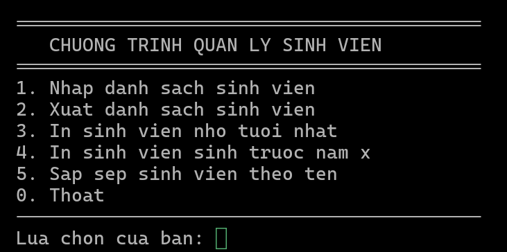
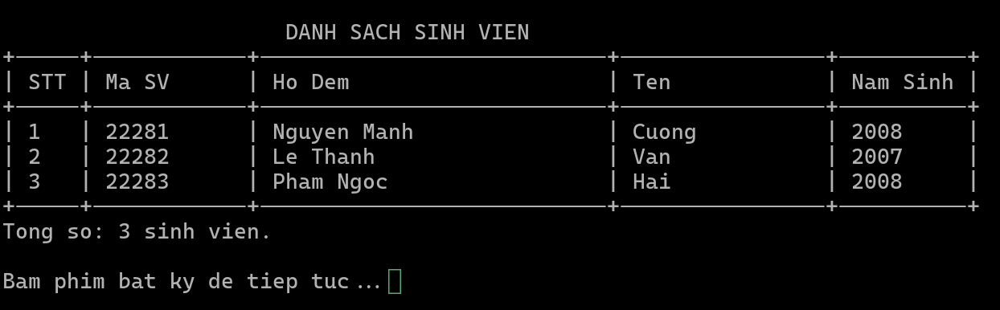

# Quản lý sinh viên

Dự án này là một ứng dụng console đơn giản để quản lý danh sách sinh viên, bao gồm các chức năng nhập xuất, sắp xếp, và tìm kiếm thông tin sinh viên.

## Mô tả dự án

Ứng dụng cho phép:
- Nhập và xuất danh sách sinh viên
- Sắp xếp danh sách theo tên
- Tìm sinh viên nhỏ tuổi nhất
- Lọc danh sách sinh viên sinh trước một năm cụ thể (người dùng nhập năm)

## Screenshots




## Cách build và chạy

### Sử dụng CMake (Khuyên dùng):
```bash
mkdir -p build && cd build
cmake ..
make
./student_manager
```

### GCC (Nhanh):
```bash
gcc src/core/*.c src/utils/*.c -o student_manager
./student_manager
```

## Thành viên và nhiệm vụ

| Thành viên | Nhiệm vụ | File liên quan |
|------------|----------|---------------|
| **[Bùi Duy Khanh](https://github.com/buikhanh0411)** (Leader) | Gộp code, tạo menu, tạo cấu trúc dự án | `main.c`, `menu.c`, `CMakeLists.txt`, cấu trúc thư mục |
| **[Võ Anh Công](https://github.com/cong2812)** | Nhập xuất danh sách sinh viên | `nhap_danh_sach_sv.c`, `xuat_danh_sach_sv.c` |
| **[Đào Đức Văn](https://github.com/Van171207)** | Đưa danh sách sinh viên trước năm (người dùng nhập số năm) | `in_sv_sinh_truoc_nam.c` |
| **[Nguyễn Đức Cường](https://github.com/Cuong0408)** | Đưa ra sinh viên nhỏ tuổi nhất | `in_sv_nho_tuoi_nhat.c` |
| **[Đặng Bá Duy](https://github.com/Duy292007)** | Sắp xếp lại danh sách theo thứ tự tăng dần của tên | `sap_xep_sv_theo_ten.c` |

## Cấu trúc dự án

```
bai_12_nnlt_c/
├── CMakeLists.txt
├── README.md
├── assets/ (thư mục chứa tài nguyên như hình ảnh, diagram)
├── build/ (thư mục build)
├── src/
│   ├── core/ (logic chính)
│   │   ├── main.c
│   │   ├── main.h
│   │   ├── menu.c
│   │   ├── nhap_danh_sach_sv.c
│   │   ├── sap_xep_sv_theo_ten.c
│   │   ├── xuat_danh_sach_sv.c
│   │   ├── in_sv_nho_tuoi_nhat.c
│   │   └── in_sv_sinh_truoc_nam.c
│   └── utils/ (tiện ích)
│       ├── utils.h
│       ├── display.c
│       └── copy.c
└── test
```
